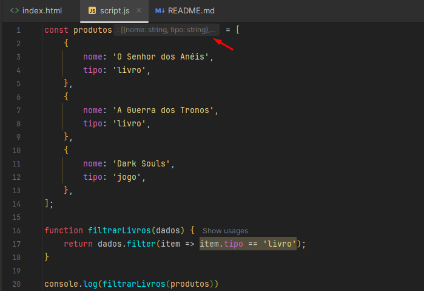
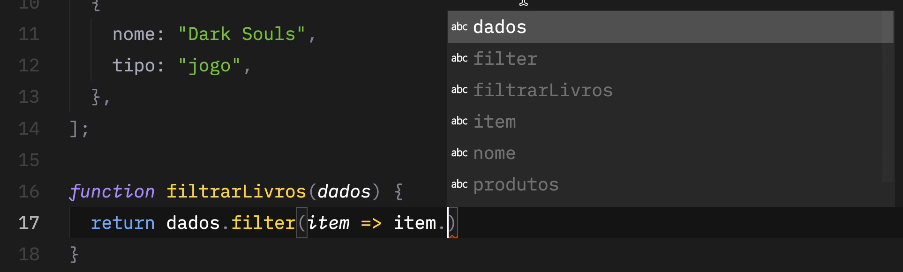
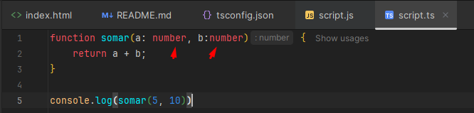

# About

Curso de Typescript para iniciantes, realizado na Origamid e lecionado pelo André Rafael.

# Types

O tipo define o que podemos fazer com um dado.

Quando definimos uma constante no arquivo javascript e atribuímos um valor a ela, a própria IDE
já é capaz de nos mostrar as propriedades daquela constante.

Se for uma string, aparecerá métodos de String, se for um Array, propriedades de array, veja:

```javascript
const frase = 'Front End';
const total = 100.05;
const empresas = ['Apple', 'Microsoft'];
const body = document.body;
const button = document.querySelector('button');

frase.toLowerCase();
// frase.toFixed();

total.toFixed();
// total.toLowerCase();

empresas.map((empresa) => empresa.toUpperCase());
// empresas.toLowerCase();

body.style.background = '#000';
// body.map((item) => item);

console.log(button);
// button.click();

const operacao = true + 'teste' - (4 * {}) / [];
const strings = 'Front ' + 'End';
const numbers = 100 + 200;
console.log(operacao, strings, numbers);
```

## Como os erros são identificados? 

Porque o TypeScript já está funcionando no fundo da nossa IDE (mesmo que não tenhamos nenhum arquivo TS criado).

## Possíveis erros com JS

Entretanto, somente com o JS, caso tentássemos realizar uma operação que não condiz com o valor, ele não nos mostraria
um erro, veja:

```javascript
const total = 100.05;

total.lowerCase();

total.toFixed();
```

Ele deveria nos mostrar um erro, visto que é um número tentando ser convertido para ``lowerCase()``.

Já o TypeScript, irá nos apontar esses erros na IDE.

Outra coisa interessante, é que o método ``toFixed()``, além de arrendondar o número, ele transforma o mesmo numa
String.

Ou seja, caso tentássemos por ventura, pegar o numero arredondado (100) e somar com + 10, o resultado seria ``10010``.

Isso é outro exemplo do que o JavaScript permite, mas que com o TypeScript, não será possível.


# Type annotations

Até a presente data, o JavaScript não possui uma forma de indicar o tipo de dado que uma variável terá.

Sim, quando declaramos variáveis simples como ``const frase = "Olá"`` ele identifica que é uma String. O problema em sí
é quando começamos a trabalhar com funções.

Não é possível, por exemplo, prever o argumento que será passado no parâmetro de funções, então utilizamos as
type annotations, "anotações de tipo".

Nós anotamos o tipo que ela irá receber e o tipo que irá retornar!

## Proposta para o JS

Existe em proposta a ideia de incluir uma sintaxe parecida com a do TypeScript direto no JavaScript:

[Link github - proposal](https://github.com/tc39/proposal-type-annotations)

❗Importante, esse resumo é datado de 2017, já o curso do André é de um pouco antes. No momento, utilizando o InteliJ,
ele foi sim capaz de identificar o objeto declarado como string e foi mostrado os métodos de filter, e também foi possível
acessar as características do objeto, como o "tipo".



Exemplo na IDE (talvez com o VSCode) seja assim:



Repare, não é possível acessar as características do objeto.

# Ferramentas TypeScript

## Node, NPM, Git

[Veja link de como instalar](https://www.origamid.com/curso/html-e-css-para-iniciantes/0801-instalar-ferramentas)

## VSCode

Opcional, eu uso Intellij.

Plugins: Liver Server, Origamid Next, Prettier


## Importando TS

Iremos criar um ``script.ts``.

❗Importante: nós não iremos importar o ``script.ts`` para o HTML.

Iremos rodar um código NPM, entenda:

Os principais programas que executam JavaScript (browser/node), não conseguem executar TypeScript. Por isso precisamos 
de um compilador para gerar um arquivo JavaScript a partir de um TypeScript.

```bash
npm install -g typescript
```

Após instalado, rodamos outro comando para que ele compile o arquivo TS em JS.

```bash
tsc script.ts
```

Ele irá criar um arquivo JS idêntico, com o mesmo código digitado!

<hr>

Para não ser necessário rodar o código acima após realizar uma alteração, iremos rodar o código abaixo. Esse
comando irá criar um arquivo ``tsconfig.son``.

```bash
tsc --init
```

Iremos abordar esse arquivo futuramente, mas iremos focar por agora somente em 3 propridades dele:

```json
{
  "compilerOptions": {
    "target": "ESNext",
    "strict": true
  }
}
```

Target irá selecionar a versão do javascript. Iremos usar a mais recente possível ``ESNext``.

O Strict mudará diversas outras configurações, uma delas é não deixar nenhum tipo de "any" acontecer.

Ou seja, se criarmos uma função, será obrigatório declarar que tipo de dado ela irá receber.



Para que ele fique observando as alterações e faça a compilação automaticamente, usamos:

```bash
tsc -w
```

Assim, ele ficará em "watch mode".
